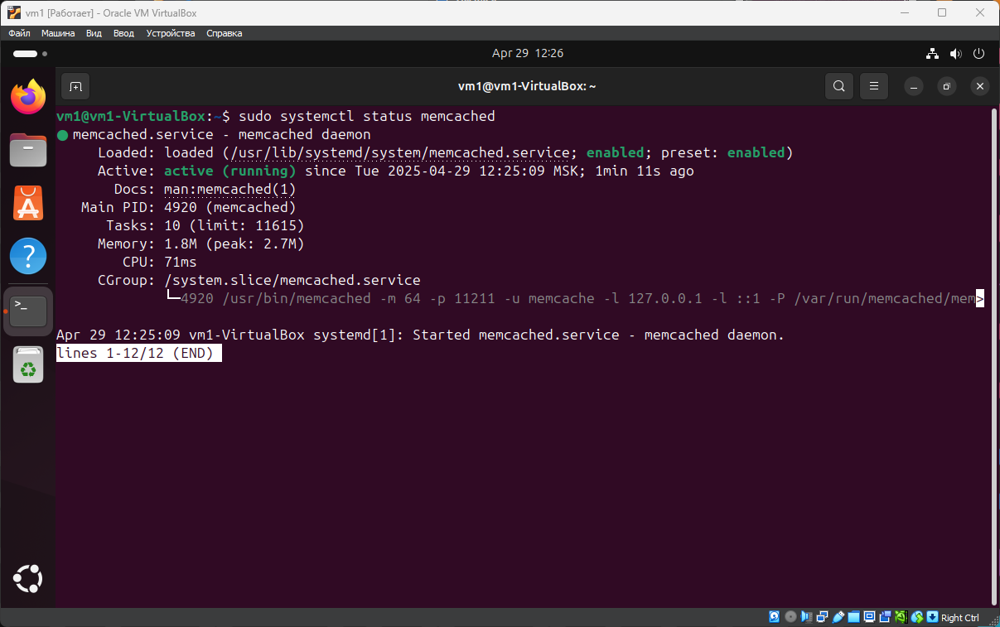
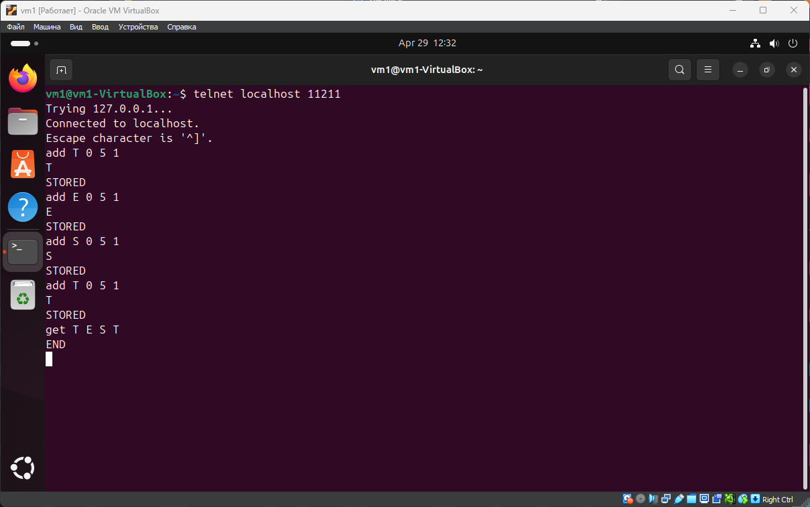
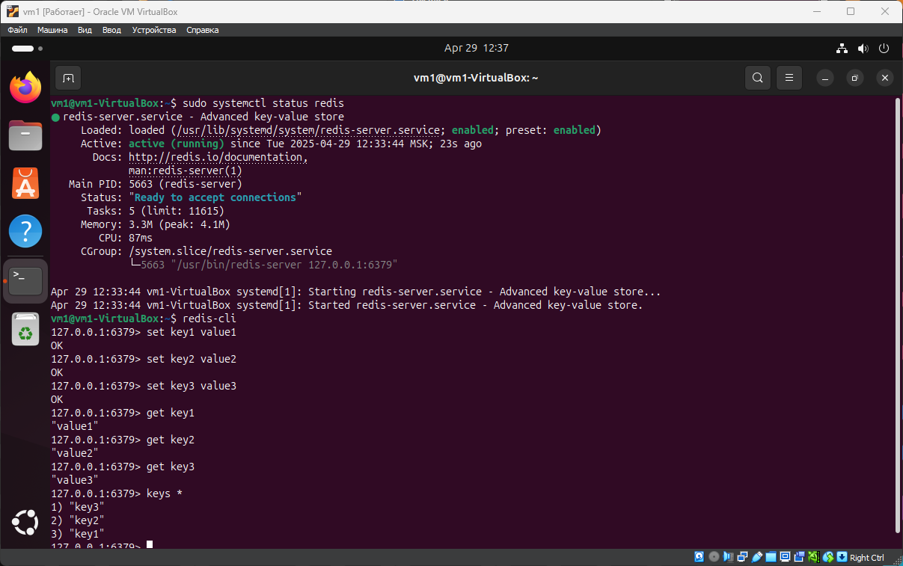

# Домашнее задание к занятию «Кеширование Redis/memcached» - Сергей Максимов

## Задание 1. Кеширование

Приведите примеры проблем, которые может решить кеширование.

*Приведите ответ в свободной форме.*

### Ответ

**Проблемы, которые может решить кеширование:**

* **Низкая производительность приложений.** Кеширование значительно ускоряет обработку запросов, так как считывание данных из кеша происходит быстрее, чем их повторное вычисление или чтение из исходного хранилища.

* **Долгая загрузка данных.** Благодаря хранению часто запрашиваемых данных в оперативной памяти, пользователи не вынуждены ждать несколько секунд или даже миллисекунд при каждом обращении к системе.

* **Нагрузка на сеть.** Кеширование позволяет избежать создания новых запросов и повторной обработки данных, что снижает накладные расходы на сетевую инфраструктуру.

* **Перегрузка серверов.** Особенно актуально при работе с динамически генерируемым контентом. Кеширование веб-сервера позволяет сократить объем работы, которую необходимо выполнить серверам.

* **Оптимизация использования ресурсов.** Кеширование помогает снизить нагрузку на центральный процессор и продлить срок службы серверов, так как уменьшается количество операций по обработке данных.

* **Экономическая эффективность.** При работе с облачными платформами и API, где оплата часто зависит от количества запросов, кеширование позволяет сократить расходы за счет уменьшения общего числа запросов к сервисам.

* **Географическая оптимизация.** Использование Content Delivery Network с кешированием позволяет размещать копии контента ближе к конечным пользователям, что сокращает задержку в сети и улучшает скорость доставки контента.

* **Масштабируемость систем.** Кеширование помогает системам лучше справляться с растущей нагрузкой, так как часть запросов обрабатывается из кеша, не нагружая основное хранилище данных.

---

## Задание 2. Memcached

Установите и запустите `memcached`.

*Приведите скриншот `systemctl status memcached`, где будет видно, что `memcached` запущен.*

### Ответ

---

## Задание 3. Удаление по TTL в Memcached

Запишите в `memcached` несколько ключей с любыми именами и значениями, для которых выставлен `TTL 5`.

*Приведите скриншот, на котором видно, что спустя 5 секунд ключи удалились из базы.*

### Ответ

---

## Задание 4. Запись данных в Redis

Запишите в `Redis` несколько ключей с любыми именами и значениями.

*Через `redis-cli` достаньте все записанные ключи и значения из базы, приведите скриншот этой операции.*

### Ответ

---